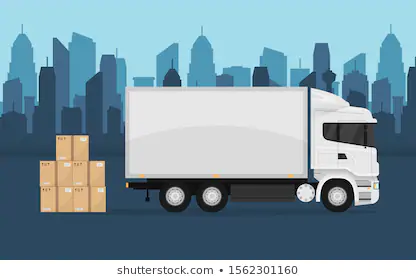

# Traslado de mercaderías

## Realizamos un relevamiento de los principales recorridos de los camiones que van de ciudad en ciudad transportando mercancías. 

De cada ciudad se conoce su nombre, los productos que produce y los productos que requiere. 

De los camiones conocemos su patente y otros datos más, según que tipo de camión sea: 
* Comun, se sabe el volumen de carga que puede llevar.
* Semi remolque, se conoce el largo, el ancho y la altura del remolque. 
* Con acoplado, se registra el volumen de la caja del camion y el del acoplado.

Se tiene registrado cada uno de los viajes que se realizaron, indicando la ciudad de origen, la ciudad de destino, la mercancía transportada, como así también la patente del camión que la transporta. Se asume que los camiones siempre viajan cargados al máximo de su capacidad.

1. Se quiere saber la patente del camión, el volumen transportado y el producto de:
- El menor viaje que alguna vez llegó o salió de la ciudad.
- El mayor viaje que llegó a una ciudad de cada producto que la ciudad requiere o produce.

2. Se necesita encontrar las ciudades que:
- Nunca les llegó un camión con algún producto que requieran.
- Recibieron viajes de todos los productos que requieren
- Salen viajes de un único producto
- Alguna vez pasó por ella un camión con acoplado donde la caja tiene más capacidad que el acoplado.

## Se pide
- Realizar los predicados que permitan resolver lo planteado
- Construir una base de conocimiento con hechos que permitan respuestas variadas de todos los items
- Mostrar ejemplos de consulta
- Analizar la inversibilidad de dos de los predicados requeridos, uno que sea inversible y otro que no, justificando conceptualmente. 
